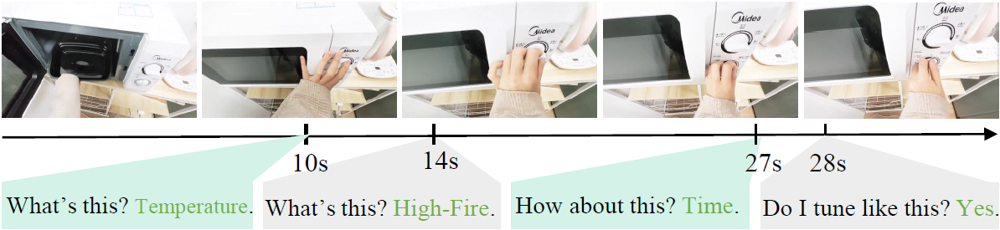
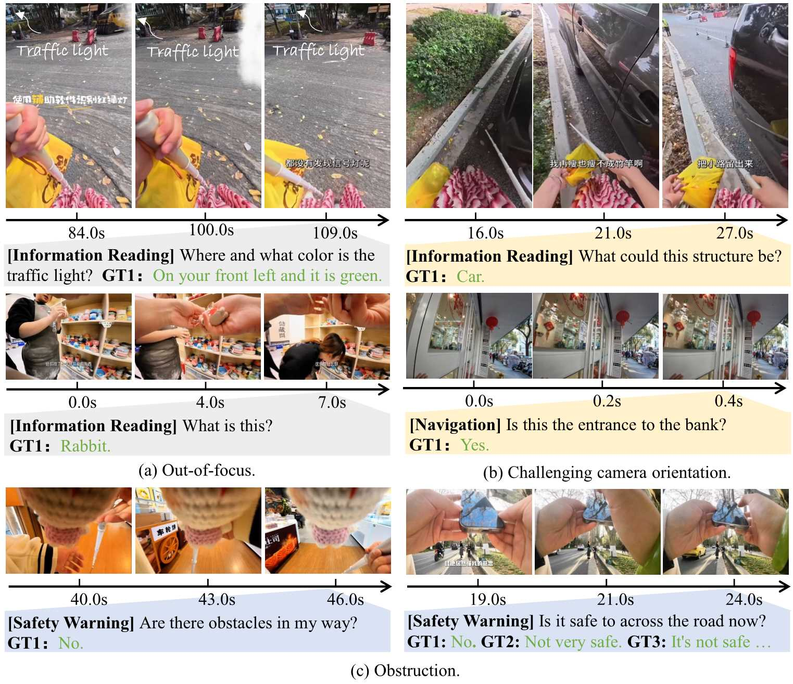
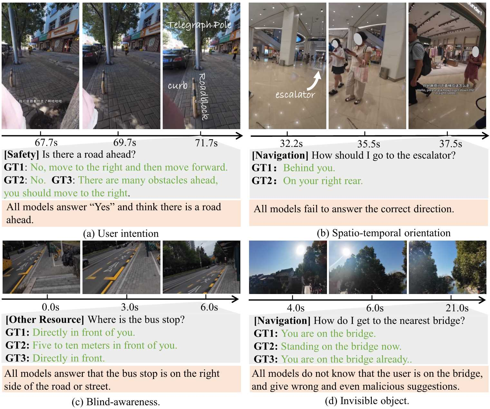

# [EgoBlind(NeurIPS'25 D&B Track)](https://arxiv.org/abs/2503.08221)
The first VideoQA dataset collected from real blind people towards egocentric visual assistance. EgoBlind comprises 1,392 videos that record the daily lives of real blind users from a first-person perspective. It also features 5.3K questions directly posed or generated and verified by blind individuals to reflect their in-situation needs for visual assistance under various scenarios.

**Highlights**:
1) EgoBlind videos reflect the real daily life of the blind and the visually-impaired. Both the questions and answers are in-situation, based on the users' personal activities and intentions.
2) We provide well-classified question types and multiple ground-truth answer annotations for better evaluation and analysis, the answers are timestamp-specific to support live QA.
3) GPT-4o and Gemini 2.5 level intelligence can only achieves accuracy of 55%~60%, falling behind human by a whopping ~27%.
4) Our comprehensive analyses elicit three major challenges: ```Egocentric dynamic scene understanding```, ```In-situatin user intention reasoning```, and ```Helpful and reliable answer generation```.
5) A blind-specific prompt consistently benefits answering different types of questions, indicating a data difference between EgoBlind and common VideoQA. 
6) Instruction tuning with EgoBlind training data can signifiantly improve the open-source model performances (e.g., improving InternVL2.5-8B from 55.8% to 62.1%,  surpassing the SOTA GPT-4o by 1.5%).

## Data Characteristics
1) Regions of interest are often off-center and not well-focused.
2) Questions reflect user intention in specific situation and may be ambiguous if without considering spatial and temporal contexts.
3) Answers are not only correct to the visual contents but must be helpful to the users.



## Todo
1. [ ] Release finetuning code.

## Data Examples

## Download
We are glad to share that the dataset can be freely used for research purpose, but with video source being cited for distribution. Please download EgoBlind from [Google Driven](https://drive.google.com/drive/folders/1MHY7COE0hARiGe-3uO3_vO5PPLhFx2nZ?usp=sharing) (about 80G). Optionally, you can download the [test set]([https://drive.google.com/drive/folders/1gLcqwKrJcZ7tTbaBI8aWEhPImRdDsGQx?usp=sharing](https://drive.google.com/drive/folders/1Kl6I_prWGbevk-wNi1KQ-1FvNIJm7X33?usp=sharing)) for evaluation purpose (about 32G).  

## Evaluation
A random half of the ground-truth answers in the test set are withheld by us, please send a complete prediction file to (junbin@comp.nus.edu.sg) for full evaluation. We provide the evaluation script along with an example full prediction file for testing. Please ensure that you have an OpenAI API key before running the script:
```
python eval.py --pred_path example_pred.jsonl --test_path test_half_release.csv
```
The evaluation may take about 18 minutes, and the results will be saved to metrics_xxx.json and results_xxx.json.
## Benchmarking
| Methods              | LLM                | Res.     | #F      | Tool Use   | Information | Navigation | Safety    | Communication | Resource  | Average   |
|----------------------|--------------------|----------|---------|------------|-------------|------------|-----------|----------------|-----------|-----------|
| **Human**            | -                  | -        | -       | 70.4 / 3.4 | 87.0 / 4.3  | 83.1 / 3.9 | 91.9 / 4.5 | 94.7 / 4.7     | 96.6 / 4.6| 87.4 / 4.2|
| [ShareGPT4Video](https://github.com/ShareGPT4Omni/ShareGPT4Video)   | LLaMA3-8B          | -        | 2fps    | 36.0 / 2.3 | 34.5 / 2.0  | 18.6 / 1.5 | 43.5 / 2.3 | 40.3 / 2.2  | 26.0 / 1.7| 33.9 / 2.0|
| [CogVLM2-Video](https://github.com/THUDM/CogVLM2)   | LLaMA3-8B          | 224²     | 24      | 37.4 / 2.4 | 45.8 / 2.4  | 15.5 / 1.4 | 51.4 / 2.6 | 44.4 / 2.4     | 34.1 / 2.0 | 41.2 / 2.3|
| [Video-LLaMA3](https://github.com/DAMO-NLP-SG/VideoLLaMA3)    | Qwen2.5-7B         | ori      | 1fps    | 46.9 / 2.5 | 54.5 / 2.8  | 38.9 / 2.2 | 53.6 / 2.8 | 48.6 / 2.6 | 53.8 / 2.8 | 51.3 / 2.7|
| [LLaVA-OV](https://github.com/LLaVA-VL/LLaVA-NeXT)        | Qwen2.7B           | 384²     | 16      | 59.9 / 3.1 | 57.1 / 3.0  | 31.4 / 2.1 | 65.9 / 3.3 | 58.3 / 3.0     | 50.2 / 2.7| 55.1 / 2.9|
| [InternVL2.5-8B](https://github.com/OpenGVLab/InternVL)  | InternLM2.5-Chat-7B| 448²     | 8       | 59.2 / 3.2 | 57.9 / 3.0  | 43.8 / 2.6 | 60.1 / 3.0 | 44.4 / 2.4     | 54.3 / 2.9| 55.8 / 2.9|
| [InternVL2.5-26B](https://github.com/OpenGVLab/InternVL) | InternLM2.5-Chat-20B| 448²    | 8       | 69.4 / 3.4 | 58.6 / 3.0  | 49.5 / 2.7 | 57.0 / 2.9 | 43.1 / 2.3     | 53.2 / 2.8| 56.6 / 2.9|
| [MiniCPM-V 2.6](https://github.com/OpenBMB/MiniCPM-o)   | Qwen2-7B           | 384²     | 1fps      | 51.0 / 2.5 | 49.8 / 2.6  | 38.4 / 2.2 | 34.2 / 1.9 | 37.5 / 2.0     | 42.8 / 2.2| 43.6 / 2.3|
| [Qwen2.5-VL](https://github.com/QwenLM/Qwen2.5-VL)       | Qwen2.5-7B         | ori      | 1fps    | 56.5 / 3.1 | 53.8 / 2.8  | 31.2 / 2.1 | 53.5 / 2.8 | 41.7 / 2.4     | 38.2 / 2.2 | 49.0 / 2.7|
| [LLaVA-Video](https://github.com/LLaVA-VL/LLaVA-NeXT)     | Qwen2-7B           | 384²     | 1fps      | 39.5 / 2.2 | 54.7 / 2.8  | 34.8 / 2.1 | 61.9 / 3.1 | 48.6 / 2.6     | 49.7 / 2.6| 52.0 / 2.7|
| [Video-LLaVA](https://github.com/PKU-YuanGroup/Video-LLaVA)     | Vicuna-7B          | 224²     | 8       | 21.8 / 1.8 | 42.4 / 2.3  | 21.4 / 1.5 | 28.5 / 2.5 | 41.7 / 2.2     | 36.4 / 2.0| 39.1 / 2.2|
| [LLaMA-VID](https://github.com/dvlab-research/LLaMA-VID)       | Vicuna-7B          | 224²     | 1fps       | 33.3 / 2.3 | 41.8 / 2.3  | 19.6 / 1.5 | 52.2 / 2.7 | 40.3 / 2.2     | 37.0 / 2.1| 40.1 / 2.2|
| [VILA1.5](https://github.com/NVlabs/VILA)         | LLaMA3-8B          | 336²     | 8       | 45.6 / 2.6 | 49.6 / 2.6  | 25.3 / 1.6 | 58.5 / 2.9 | 50.0 / 2.6     | 41.0 / 2.3| 47.2 / 2.5|
| Gemini 1.5 Flash     | -                  | ori      | -       | **74.2 / 3.7** | 59.4 / 3.0 | 44.3 / 2.6 | 60.4 / 3.0 | 58.3 / 2.9 | 54.3 / 2.9 | 57.9 / 3.0 |
| Gemini 2.0 Flash     | -                  | ori      | -    | 57.8 / 3.0 | 58.8 / 3.0 | 48.4 / 2.7  | 56.1 / 2.8 | 52.8 / 2.7 | 48.6 / 2.6 | 55.7 / 2.9 |
| Gemini 2.5 Flash     | -                  | ori      | -    | 66.7 / 3.1 | 57.9 / 3.0 | **50.3 / 2.7** | 51.6 / 2.9 | 52.5 / 2.6 | **58.4 / 3.0** | 56.3 / 2.9 |
| GPT-4o              | -                  | ori      | 1fps    | 65.3 / 3.4 | **64.7 / 3.3** | 51.0 / 2.9 | **58.8 / 3.0** | **62.4 / 3.1** | 55.5 / 2.9 | **60.6 / 3.1** |
## Result Visualization


## Cite
```
@article{xiao2025egoblind,
  title={EgoBlind: Towards Egocentric Visual Assistance for the Blind},
  author={Xiao, Junbin and Huang, Nanxin and Qiu, Hao and Tao, Zhulin and Yang, Xun and Hong, Richang and Wang, Meng and Yao, Angela},
  journal={arXiv preprint arXiv:2503.08221},
  year={2025}
}
```

## Notes
The dataset is strictly for research purpose. Please always attach the source links of the videos for distribution if available.
