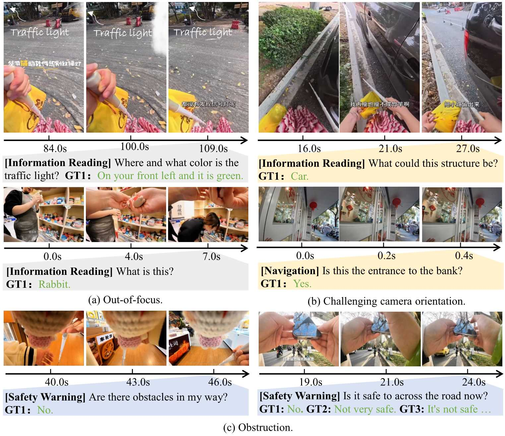

# EgoBlind
The first VideoQA datasets towards egocentric visuall assistance for the Blind. EgoBlind comprises 1,392 videos that record the daily lives of real blind users from a first-person perspective. It also features 5.3K questions directly posed or generated and verified by blind individuals to reflect their needs for visual assistance under various scenarios.

The videos are collected from famous video media platform, such as Bilibili and TikTok. The questions are obtained through three approaches:
1) Manual Extraction (~540): We manually extract the visually-assistive questions directly posed by the blind users in the videos.
2) AI-Generation (Role-play prompting) (~4.4K): We prompt GPT-4o to act as blind users and generate questions by engaging in their egocentric perspective. **The generated questions are further verified and edited by both sighted and visually
   impaired people, ensuring their correctness and alignment with blind users’ true needs.**
3) Blind User Annotation (~300): For some videos, we introduce their major contents to the blind individuals and invite them to annotate assistive questions when confronted with the visual situations.

## Data Examples

## Download
Please download EgoBlind from [Google Driven](https://drive.google.com/drive/folders/1MHY7COE0hARiGe-3uO3_vO5PPLhFx2nZ?usp=sharing) (about 80G). Optionally, you can download the [test set](https://drive.google.com/drive/folders/1gLcqwKrJcZ7tTbaBI8aWEhPImRdDsGQx?usp=sharing) for evaluation purpose (about 32G).  

## Benchmarking
| Methods              | LLM                | Res.     | #F      | Tool Use   | Information | Navigation | Safety    | Communication | Resource  | Average   |
|----------------------|--------------------|----------|---------|------------|-------------|------------|-----------|----------------|-----------|-----------|
| **Human**            | -                  | -        | -       | 70.4 / 3.4 | 87.0 / 4.3  | 83.1 / 3.9 | 91.9 / 4.5 | 94.7 / 4.7     | 96.6 / 4.6| 87.4 / 4.2|
| [ShareGPT4Video](https://github.com/ShareGPT4Omni/ShareGPT4Video)   | LLaMA3-8B          | -        | 2fps    | 36.0 / 2.3 | 34.5 / 2.0  | 18.6 / 1.5 | 43.5 / 2.3 | 40.3 / 2.2     | 26.0 / 1.7| 33.9 / 2.0|
| [CogVLM2-Video](https://github.com/THUDM/CogVLM2)   | LLaMA3-8B          | 224²     | 24      | 37.4 / 2.4 | 35.6 / 2.0  | 15.5 / 1.4 | 41.4 / 2.6 | 44.4 / 2.4     | 34.1 / 2.0| 41.1 / 2.3|
| [Video-LLaMA3](https://github.com/DAMO-NLP-SG/VideoLLaMA3)    | Qwen2.5-7B         | ori      | 1fps    | 46.9 / 2.5 | 54.5 / 2.8  | 38.9 / 2.2 | 53.6 / 2.7 | 48.6 / 2.6     | 53.8 / 2.8| 49.4 / 2.7|
| [LLaVA-OV](https://github.com/LLaVA-VL/LLaVA-NeXT)        | Qwen2.7B           | 384²     | 16      | 51.6 / 2.7 | 55.7 / 3.1  | 31.4 / 2.1 | 49.8 / 2.3 | 50.0 / 2.7     | 46.4 / 2.5| 47.9 / 2.6|
| [InternVL2.5-8B](https://github.com/OpenGVLab/InternVL)  | InternLM2.5-Chat-7B| 448²     | 8       | 59.2 / 3.5 | 57.6 / 2.9  | 43.8 / 2.6 | 60.1 / 3.0 | 54.3 / 2.9     | 54.3 / 2.9| 55.6 / 2.9|
| [InternVL2.5-26B](https://github.com/OpenGVLab/InternVL) | InternLM2.5-Chat-20B| 448²    | 8       | 59.4 / 3.4 | 56.9 / 3.0  | 49.5 / 2.7 | 60.7 / 2.9 | 56.0 / 2.8     | 56.8 / 2.9| 56.6 / 2.9|
| [MiniCPM-V 2.6](https://github.com/OpenBMB/MiniCPM-o)   | Qwen2-7B           | 384²     | 16      | 51.0 / 2.5 | 49.8 / 2.6  | 38.4 / 2.2 | 34.2 / 1.7 | 37.5 / 2.0     | 42.8 / 2.2| 42.3 / 2.3|
| [Qwen2.5-VL](https://github.com/QwenLM/Qwen2.5-VL)       | Qwen2.5-7B         | ori      | 1fps    | 56.5 / 3.1 | 58.3 / 2.8  | 31.2 / 2.1 | 53.1 / 2.8 | 41.7 / 2.4     | 49.0 / 2.7| 48.5 / 2.7|
| [LLaVA-Video](https://github.com/LLaVA-VL/LLaVA-NeXT)     | Qwen2-7B           | 384²     | 16      | 39.5 / 2.2 | 54.7 / 2.8  | 28.1 / 1.6 | 61.9 / 3.1 | 44.3 / 2.6     | 40.9 / 2.6| 44.9 / 2.5|
| [Video-LLaVA](https://github.com/PKU-YuanGroup/Video-LLaVA)     | Vicuna-7B          | 224²     | 8       | 21.8 / 1.8 | 42.4 / 2.3  | 21.1 / 1.5 | 29.5 / 2.5 | 41.7 / 2.2     | 36.4 / 2.0| 32.1 / 2.1|
| [LLaMA-VID](https://github.com/dvlab-research/LLaMA-VID)       | Vicuna-7B          | 224²     | 8       | 33.3 / 2.3 | 42.3 / 2.8  | 19.6 / 1.5 | 52.2 / 2.7 | 40.3 / 2.2     | 37.0 / 2.1| 40.7 / 2.2|
| [VILA1.5](https://github.com/NVlabs/VILA)         | LLaMA3-8B          | 336²     | 8       | 45.6 / 2.6 | 49.6 / 2.6  | 25.3 / 1.6 | 58.5 / 2.9 | 50.0 / 2.6     | 41.0 / 2.3| 47.2 / 2.5|
| Gemini 1.5 Flash     | -                  | ori      | -       | **74.2 / 3.7** | 59.4 / 3.0 | 44.3 / 2.6 | 60.4 / 3.0 | 58.3 / 2.9 | 54.3 / 2.9 | 57.9 / 3.0 |
| Gemini 2.0 Flash     | -                  | ori      | 1fps    | 58.8 / 3.0 | 48.4 / 2.7 | 35.0 / 2.2 | 48.6 / 2.6 | 46.6 / 2.4 | 48.1 / 2.6 | 47.6 / 2.6 |
| Gemini 2.5 Flash     | -                  | ori      | 1fps    | 66.7 / 3.1 | 57.9 / 3.0 | **50.3 / 2.7** | 51.6 / 2.9 | 52.5 / 2.6 | **58.4 / 3.0** | 56.3 / 2.9 |
| GPT-4o              | -                  | ori      | 1fps    | 65.3 / 3.4 | **64.7 / 3.3** | 51.0 / 2.9 | **58.8 / 3.0** | **62.4 / 3.1** | 55.5 / 2.9 | **60.6 / 3.1** |

## License
The dataset is strictly for research purpose. By downloading it, you automatically agree to our terms of use.
